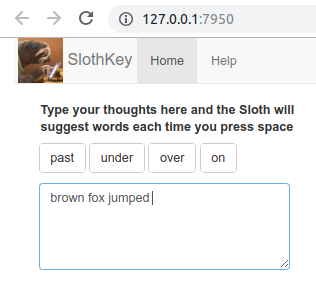

```{r setup, include=FALSE}
knitr::opts_chunk$set(echo = FALSE)
library(quanteda)
```


##What is this

SlothKey is an app that suggests you words as you type so that you can type less and write more.  
<div class="columns-2">
  {width=250px}
  <br>
  
  App usage is really simple and intuitive. Just type your thoughts in the text box and the App will suggest words each time you press space or select a suggestion. Clicking on a suggestion will add it to the end of your text. Convenient!  
If neither of the suggestions fit you, just continue on typing.
</div>

##Under the hood
description of the algorithm used to make the prediction

If you've spent some time playing around with the app, you might be curious, how does it make such good suggestions?
There must be some quite complicated machine leaning algorithms in use here! 
Well, no. The whole app relies on a lot of data and 2 simple ideas: n-grams and stupid backoff.

##N-grams
N-grams are combinations of n words taken from a text.
So if a text was "The quick brown fox jumps over another quick brown fox" then 3-grams for it would be:  
```{r brown_fox, echo=FALSE, comment=NA}
fox = "The quick brown fox jumps over another quick brown fox"
foxtok = tokens(fox,ngrams = 3, remove_number =T)
myfun <- function(x) {paste("\n", strrep(" ",cumsum(nchar(x)+1)))}
lal <- sapply(strsplit(fox," "),myfun)
cat(unlist(foxtok), sep = lal)
```
Where all combinations will have number of appearances 1 except for "quick_brown_fox", which will have 2.  
When this approach is applied to a vast corpus of text, you get a pretty large language model which contains a lot of common collocations (phrases). What is left is for every input a user gives to find in the model several n-1 grams for which 3 last words of the input match the best and present their last word as a suggestion.  
But this raises several questions from the get go:  
  - What if a user types a phrase so rare it does not exist in our model?  
  - If there are several suggestions, how do you determine the best one?  
  
##Enter the second idea: Stupid backoff
it allows to solve both problem at the same time
The idea is simple: if the algorithm doesn't find ngram that begins with the given phrase, it looks for n-1 gram that begins with the same phrase but without the first word. If n-1nram was not found either, back off to n-2gram and so on until 1-grams are reached, at which case just the most frequent words are returned as suggestion.  
This process may be expressed by the following example formula:

$$S(\text{tips }|\text{ here are a few})= \begin{cases}
  f(\text{here are a few tips})\over f(\text{here are a few}) &, \text{if } f(\text{here are a few tips}) >0 \\
  αS(\text{tips }|\text{ are a few}) &, \text{otherwise}.
\end{cases}$$

Where $S$ is a score of a suggestion, $f$ is frequency of an ngram and $α$ is backoff factor.
The formula also calculates scores of the found ngrams which allows to select single best suggestion for the input.


##trash

$$S(\text{things }|\text{ here are a few})= \begin{cases}
  f(\text{here are a few things})\over f(\text{here are a few}) &, \text{if } \text{"here are a few things"} \text{ found} \\
  αS(\text{things }|\text{ are a few}) &, \text{otherwise}.
\end{cases}$$


which means that we estimate the score of each found suggestion based on frequency
which means that we back off from longer to shorter ngrams as we search for an ngram that starts with the given input.
So in our example input text 2 suggestions were found: things and tips.  
This formula defines a recursive pattern where if 

blablablablablablablablablablablablablablablablablablablablab
lablablablablablablablablablablablablablablablablablablablablablabl
ablablablablablablablablablablablablablablablablablablablablablabla
blablablablablablablablablablablablablablablablablablabla


