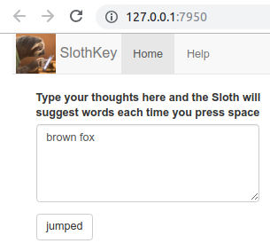

```{r eval=FALSE, include=FALSE}
#creates help file for the app from this rmd. Run it manually.
rmarkdown::render('index.Rmd', output_file = 'www/help.html',output_format = "html_document", output_options = " smaller: no")
```


```{r setup, include=FALSE}
knitr::opts_chunk$set(echo = FALSE)
library(quanteda)
```


##What is this

SlothKey is an app that suggests you words as you type so that you can type less and write more!  
<div class="columns-2">
  {width=250px}
  <br>
  <br>
App usage is really simple and intuitive. Just type your thoughts in the text box and the App will suggest words each time you press space or select a suggestion. Clicking on a suggestion will add it to the end of your text. Convenient!  
If neither of the suggestions fit you, just continue on typing.
</div>


If you've spent some time playing around with the app, you might be curious, how does it make such good suggestions?
There must be some quite complicated machine leaning algorithms in use here!? 
Well, no. The whole app relies on a lot of training data and 2 simple ideas: n-grams and stupid backoff.

##N-grams

```{r brown_fox, include=FALSE}
fox <- "brown fox jumped over another brown fox"
ngrams <- 2
```

<div class="columns-2">
N-grams are combinations of n words taken from a text.
So if a text was "`r fox`"  then `r ngrams`grams for it would be:  

```{r ngrams, echo=FALSE, comment=NA}
foxtok = tokens(fox,ngrams = ngrams, remove_number =T)
myfun <- function(x) {paste("\n", strrep(" ",cumsum(nchar(x)+1)))}
lal <- sapply(strsplit(fox," "),myfun)
cat(unlist(foxtok), sep = lal)
```
Where all `r ngrams`grams will have frequency 1 except "brown_fox", which will have 2.  
When this approach is applied to a vast corpus of text, you get a large database which contains a lot of common phrases and their frequency in the speech.  

Now then, to predict the next word a user will type, you take n last words he already typed and look for n+1 gram that begins with these words. The last word of the found ngram is your prediction.

But this raises several questions:  
  - What if a user types a phrase so rare it does not exist in our database?  
  - If several predictions were found, how do you determine the best one to suggest?  
</div>  

##The second idea: Stupid backoff 
The idea is simple and answers both questions at the same time: if the algorithm doesn't find ngram that begins with the given phrase, it looks for n-1gram that begins with the same words but without the first word. If n-1gram was not found either, back off to n-2gram and so on until 1grams are reached, at which case just the most frequent words are returned as suggestion.  
This process is expressed in the second case of the following example formula:

$$S(\text{tips }|\text{ here are a few})= \begin{cases}
  f(\text{here are a few tips})\over f(\text{here are a few}) &, \text{if } f(\text{here are a few tips}) >0 \\
  αS(\text{tips }|\text{ are a few}) &, \text{otherwise}.
\end{cases}$$

Where $S$ is a score of a suggestion, $f$ is frequency of an ngram and $α$ is backoff factor that equalizes the scores between different ngram orders.  
The first case of formula calculates scores of the found ngrams which allows to select single best suggestion for the input.


## Performance
The following report sums up the main performance characteristics of the model. 
While 13% precision seems low, it's perceived accuracy is close to other similar solutions present on the market.
Such precision is actually quite close to the upper bound of what is possible with a backoff model.  

```{r load, include=FALSE}
data.dir <- "/home/michael/Studies/Coursera/10-Capstone/corpus/en_US"
`%/%` = function(e1,e2) return(paste(e1,e2, sep = "/"))
library(LaF)
library(sqldf)
source("../dsci-benchmark/benchmark.R")
load('profane.rda')
# db which has:1 to 5 grams, stopwords remain , freq=1 filtered out, indices created, 746 MB
dbname <- "." %/% "ngrams"
source('predict.R')
```


```{r Performance, echo=FALSE, cache=T, comment=NA}
load('../Week2/benchmark.rds')
cat(bench[1:3])
```

A 100 millisecond delay per suggestion is barely acceptable in terms of user experience. (Hence, the name (⊙ω⊙) )
It may be further improved, but this is out of the scope for current work.


<br>
<br>
<br>

<center>
###Questions?
</center>

<!-- ##trash -->

<!-- $$S(\text{things }|\text{ here are a few})= \begin{cases} -->
<!--   f(\text{here are a few things})\over f(\text{here are a few}) &, \text{if } \text{"here are a few things"} \text{ found} \\ -->
<!--   αS(\text{things }|\text{ are a few}) &, \text{otherwise}. -->
<!-- \end{cases}$$ -->

<!-- Now, for every 3 last words of the user input you look up in the database n-grams which match the input. -->
<!-- and present their last word as a suggestion.   -->


<!-- now then, to predict the next word a user will type next, you look up in your language model narams that beginsimilarly to the user input andsuggest   what he already typed and  -->

<!-- which means that we estimate the score of each found suggestion based on frequency -->
<!-- which means that we back off from longer to shorter ngrams as we search for an ngram that starts with the given input. -->
<!-- So in our example input text 2 suggestions were found: things and tips.   -->
<!-- This formula defines a recursive pattern where if  -->


